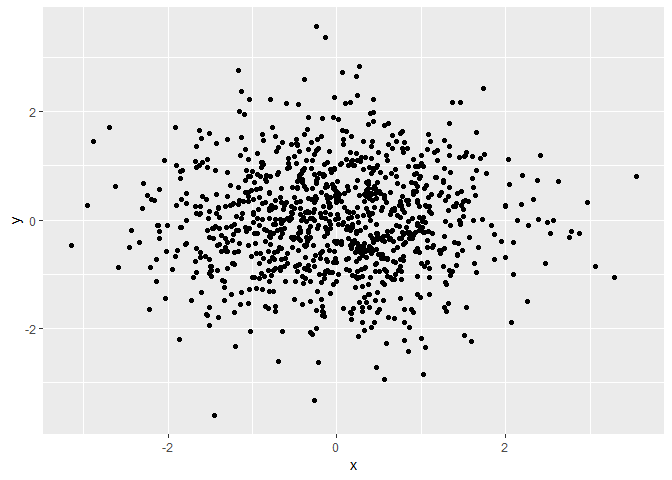

Homework 1
================
Bihui Sun
2018-09-18

Problem 1
=========

``` r
library(tidyverse)
```

    ## -- Attaching packages -------------------------------------------------------------------------------- tidyverse 1.2.1 --

    ## v ggplot2 3.0.0     v purrr   0.2.5
    ## v tibble  1.4.2     v dplyr   0.7.6
    ## v tidyr   0.8.1     v stringr 1.3.1
    ## v readr   1.1.1     v forcats 0.3.0

    ## -- Conflicts ----------------------------------------------------------------------------------- tidyverse_conflicts() --
    ## x dplyr::filter() masks stats::filter()
    ## x dplyr::lag()    masks stats::lag()

``` r
data_hw=tibble(
  unif = runif(n=10,min=0,max=5),
  logic= unif>2,
  char = c("1995/03/18","1996/03/18","1997/03/18","1998/03/18","1999/03/18","2000/03/18","2001/03/18","2002/03/18","2003/03/18","2004/03/18"),
  fact = factor(c("Male","Male","Female","Male","Female","Male","Female","Female","Female","Male"))
)
data_hw
```

    ## # A tibble: 10 x 4
    ##     unif logic char       fact  
    ##    <dbl> <lgl> <chr>      <fct> 
    ##  1 0.390 FALSE 1995/03/18 Male  
    ##  2 3.01  TRUE  1996/03/18 Male  
    ##  3 4.36  TRUE  1997/03/18 Female
    ##  4 2.39  TRUE  1998/03/18 Male  
    ##  5 3.72  TRUE  1999/03/18 Female
    ##  6 4.55  TRUE  2000/03/18 Male  
    ##  7 0.949 FALSE 2001/03/18 Female
    ##  8 2.61  TRUE  2002/03/18 Female
    ##  9 3.86  TRUE  2003/03/18 Female
    ## 10 1.22  FALSE 2004/03/18 Male

``` r
guess_1=as.numeric(data_hw$logic)
guess_1
```

    ##  [1] 0 1 1 1 1 1 0 1 1 0

``` r
guess_2=as.numeric(data_hw$char)
```

    ## Warning: NAs introduced by coercion

``` r
guess_2
```

    ##  [1] NA NA NA NA NA NA NA NA NA NA

``` r
guess_3=as.numeric(data_hw$fact)
guess_3
```

    ##  [1] 2 2 1 2 1 2 1 1 1 2

``` r
guess_4=as.character(data_hw$fact)
guess_4
```

    ##  [1] "Male"   "Male"   "Female" "Male"   "Female" "Male"   "Female"
    ##  [8] "Female" "Female" "Male"

-   The mean of unif is 2.7053746
-   The mean of logic is 0.7
-   The mean of char is NA
-   The mean of fact is NA

Problem 2
=========

``` r
library(tidyverse)
answer_hw=tibble(
    x=rnorm(1000,mean=0,sd=1),                    
    y=rnorm(1000,mean=0,sd=1),
    logic_2=x+y>0,
    num_2=as.numeric(logic_2),
    fact_2=as.factor(logic_2)
)
answer_hw
```

    ## # A tibble: 1,000 x 5
    ##          x      y logic_2 num_2 fact_2
    ##      <dbl>  <dbl> <lgl>   <dbl> <fct> 
    ##  1  0.659   1.32  TRUE        1 TRUE  
    ##  2 -1.15    2.00  TRUE        1 TRUE  
    ##  3 -1.00   -1.05  FALSE       0 FALSE 
    ##  4  0.559   0.400 TRUE        1 TRUE  
    ##  5  0.856  -0.258 TRUE        1 TRUE  
    ##  6 -0.0452  1.90  TRUE        1 TRUE  
    ##  7  0.417   0.119 TRUE        1 TRUE  
    ##  8  0.642   0.864 TRUE        1 TRUE  
    ##  9  0.446   0.228 TRUE        1 TRUE  
    ## 10 -0.374  -0.682 FALSE       0 FALSE 
    ## # ... with 990 more rows

``` r
ggplot(answer_hw, aes(x=x,y=y),col="pink") + geom_point()
```



``` r
ggsave("hwi_bisu8857.pdf", height = 4, width = 6)
```

-   The size is 1000
-   The mean is -0.0272552
-   The median is -0.0140163
-   The proportion of number of True is 0.482
